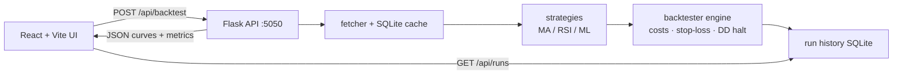

# trading strategy backtester

## what it is

Paper backtests in the browser: Yahoo history -> MA / RSI / ML signals -> long-only sim with transaction costs, risk limits, and walk-forward honesty on the ML path. Not live trading advice.

## layout

```
trading-strategy-backtester/
  README.md
  NOTES.md           # scratch for future me
  run.sh             # flask + vite together
  backend/           # flask api + strategies + engine
  backend/Dockerfile
  frontend/          # react vite ui
  backend/tests/
```

## quick start

```bash
./run.sh
```

Starts Flask on :5050 and the Vite UI on :5173 (opens the browser).

Or manually:

```bash
# backend
cd backend
python3 -m venv .venv
source .venv/bin/activate
pip install -r requirements.txt
python app.py          # http://127.0.0.1:5050

# frontend (new terminal)
cd frontend
npm install
npm run dev            # http://localhost:5173 - proxies /api -> :5050
```

## stack

Python · Flask · pandas · scikit-learn · ta · SQLite · React · Vite · Recharts · pytest

## how its wired



UI posts ticker / dates / strategy / costs -> Flask fetches (or hits the 24h cache) -> strategy stamps a `signal` column -> engine walks day by day -> metrics + curves go back as JSON and land in the run history db. Vite proxies `/api` to `:5050` in dev so the browser stays same-origin.

## whats interesting

- costs are first-class - commission + slippage in bps, not a free fantasy fill
- **with costs vs zero-cost toggle** - same signals, two equity curves, so "edge" that dies on fees is obvious
- risk limits: optional stop-loss and max-drawdown halt (flatten, no new buys)
- position size % of cash (not forced all-in)
- trade blotter - closed round-trips with entry/exit, pnl %, reason, fees
- metrics beyond a green curve: Sortino, avg win/loss, time-in-market, profit factor
- **compare mode** - same ticker/dates/costs, MA vs RSI vs ML in one table
- **desk note** on a run - short judgment line you save after looking at the charts
- **csv export** - metrics + trades download
- ML path: **OOS only** badge + train/test date labels on the chart; walk-forward fold table
- run history in SQLite - click a past run and reload the curves
- strategies stay dumb: they only emit `1 / -1 / 0`; the engine owns fills and risk

## limitations

- paper only - no brokerage, no live orders, no "this will make money"
- daily close fills - ignores intraday path; real fills differ
- simple cost model - constant bps, not venue fees or impact
- long-only - no shorts or multi-name portfolio; sizing is % of cash per entry
- ML is a toy classifier (label ~= next day up > 0.5%); walk-forward helps, doesn't erase overfitting
- Yahoo data - free delayed/adjusted history; gaps and adjustments happen
- **SQLite on purpose** for run history - single-user demo. Postgres would only matter if many people hit this at once; not worth the ops overhead here.

## tests

```bash
cd backend && pytest -q
```

## demo

```bash
./run.sh
```

Or the manual quick start above (API on :5050, UI on :5173).
