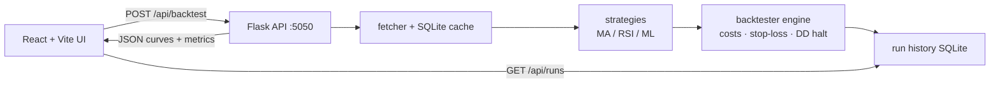

# trading strategy backtester

## what it is

Paper backtests in the browser. Yahoo daily history goes through a few strategies (moving average crossover, RSI, a toy sklearn classifier), then a long-only-by-default sim with transaction costs, next-bar fills, and optional risk limits. I built it to see how a clean equity curve changes once fees and out-of-sample rules exist. Not live trading, not advice.

## layout

```
trading-strategy-backtester/
  README.md
  run.sh                      # flask + vite together
  docker-compose.yml          # api + ui (sqlite volume for run history)
  .github/workflows/ci.yml    # pytest + vitest + frontend build
  backend/                    # flask, strategies, engine
  backend/app.py              # thin http router
  backend/backtester/         # engine + walk-forward
  backend/strategies/         # ma / rsi / ml facade (signals only)
  backend/data/               # yahoo fetcher, 24h cache, run_store
  backend/data/fixtures/      # DEMO csv - offline paper series
  backend/tests/              # pytest (yahoo mocked)
  frontend/                   # react + vite
  frontend/src/               # one-screen desk ui
```

## quick start

```bash
./run.sh
```

Flask on :5050, Vite UI on :5173 (opens the browser). Port 5050 on purpose - macOS AirPlay often grabs 5000 and returns 403 through the vite proxy.

Offline (no Yahoo): pick ticker **DEMO** in the UI - it loads `backend/data/fixtures/demo_ohlcv.csv`. Real tickers still need network for Yahoo.

Docker (api needs network for Yahoo unless you only run DEMO):

```bash
docker compose up --build
```

UI http://localhost:5173, API http://localhost:5050.

Manual:

```bash
# backend
cd backend
python3 -m venv .venv
source .venv/bin/activate
pip install -r requirements.txt
python app.py          # http://127.0.0.1:5050

# frontend (new terminal)
cd frontend
npm install
npm run dev            # http://localhost:5173 - proxies /api -> :5050
```

## stack

- backend: Flask, pandas, scikit-learn, ta, SQLite (market cache + run history)
- frontend: React, Vite, Recharts (lazy-loaded charts)
- tests: pytest (mocked Yahoo), Vitest (api client smoke)

## how its wired



UI posts ticker / dates / strategy / costs. Flask hits a 24h SQLite cache or Yahoo (or the DEMO fixture), then the strategy stamps a `signal` column (`1 / -1 / 0`). The engine walks day by day (fills, fees, optional stop-loss / max-drawdown halt). Same signals are simulated twice - with your costs and with zero costs - so the UI can overlay both curves. Metrics and curves go back as JSON and into `backtest_runs.db`. Vite proxies `/api` to `:5050` in dev.

## whats interesting

- costs are on every fill: commission + slippage in bps (buy fill worse, sell fill worse). buy-hold uses the same entry cost model so the baseline is not free
- fills default to next bar close (signal on day t executes at day t+1 close). same-bar is still a toggle - useful for showing why same-close fills are optimistic
- stop-loss, max-drawdown halt, and position size as % of cash live in the engine - strategies stay dumb and only emit signals
- optional shorting (off by default): `-1` when flat can open a short. no borrow / locate cost
- metrics beyond total return: Sharpe and Sortino (annualised with 252 trading days), max drawdown, win rate, avg win/loss, time-in-market, profit factor, trade blotter
- ML path: random forest on RSI / SMAs / MACD / returns; label is next-day return > 0.5%. walk-forward (expanding train window) is the API/UI default. train bars get signal 0. `oos_metrics` rebases headline numbers from the first OOS bar so flat in-sample equity does not dominate
- `ml_strategy.py` is only a facade - features, folds, and predict live in `backtester/walk_forward.py`
- compare mode runs MA / RSI / ML under the same ticker, dates, and costs
- run history in SQLite with desk notes, delete, and clear - single-user on purpose
- **DEMO** ticker: committed fixture CSV so clone + demo works with no network

## limitations

- paper only - no brokerage, no live orders
- next-bar is the honest default; same-bar still exists and shares signal + fill on one close
- cost model is flat bps, not venue fees or market impact
- long-only is the default story; shorts are a thin paper extension on one ticker (no multi-name portfolio)
- ML is a toy classifier. walk-forward helps, it does not erase overfitting if you keep retuning on the same window
- full-period Sharpe / return still include flat in-sample equity - use `oos_metrics` for the OOS slice
- Yahoo is free delayed/adjusted history; column shape drifts and gaps happen (fetcher normalises MultiIndex / Adj Close)
- DEMO is synthetic paper data for offline demos - not a real market series
- SQLite for cache + history - fine for one person. not a multi-user production store

## tests

```bash
cd backend && pytest -q
cd frontend && npm test && npm run build
```

## demo

```bash
./run.sh
```

In the UI pick ticker **DEMO**, dates inside 2023-01 to 2024-08, strategy MA or RSI, then run. No Yahoo required for that path.

Or the manual quick start (API :5050, UI :5173). Real tickers need network.
